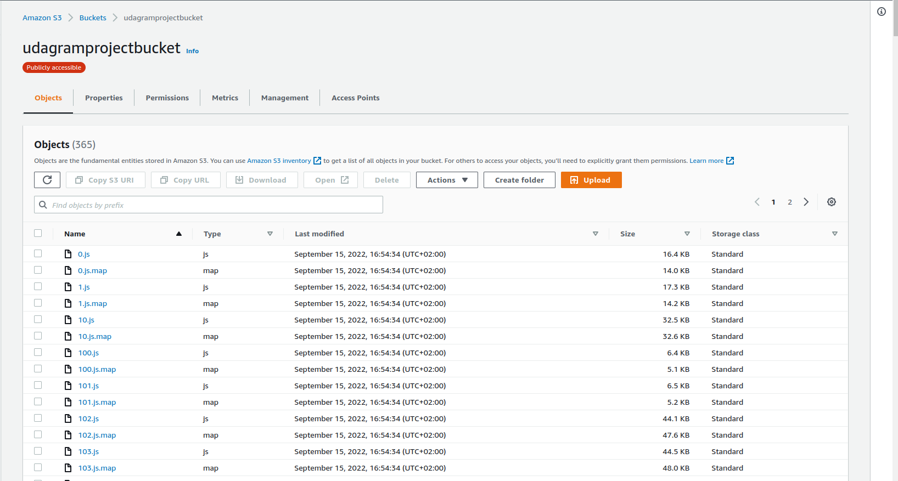
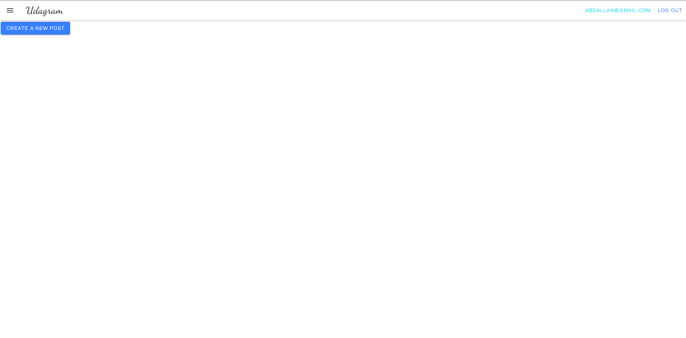
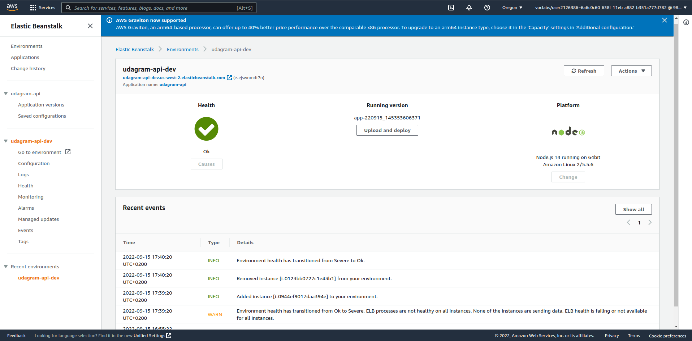
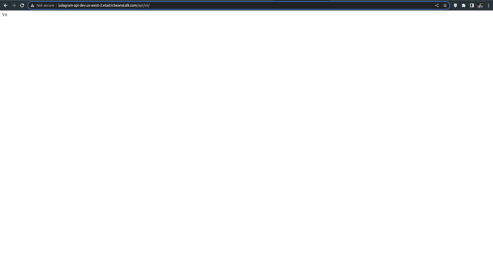
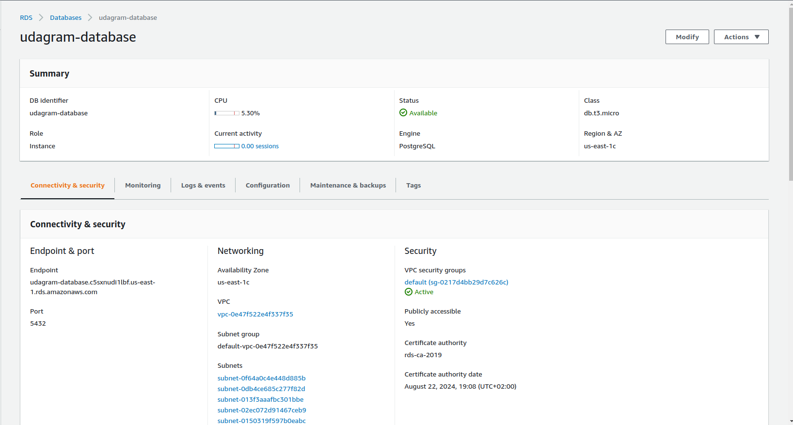
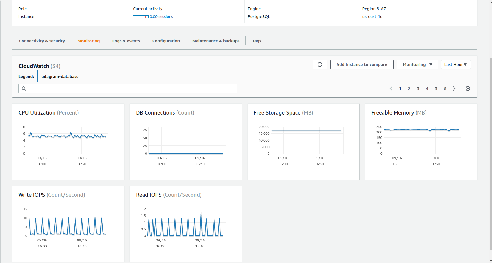
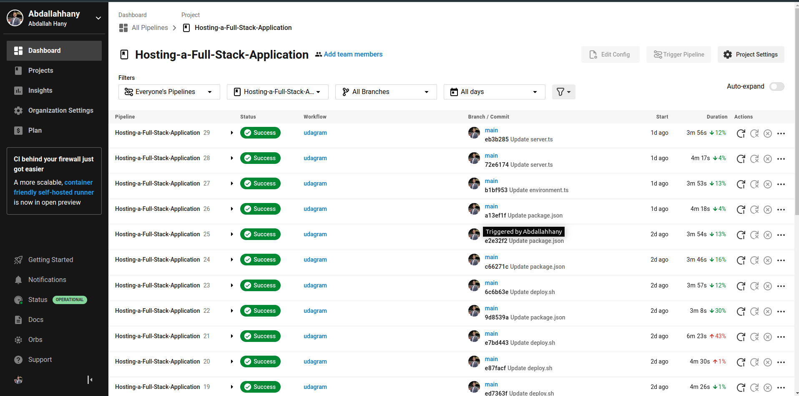
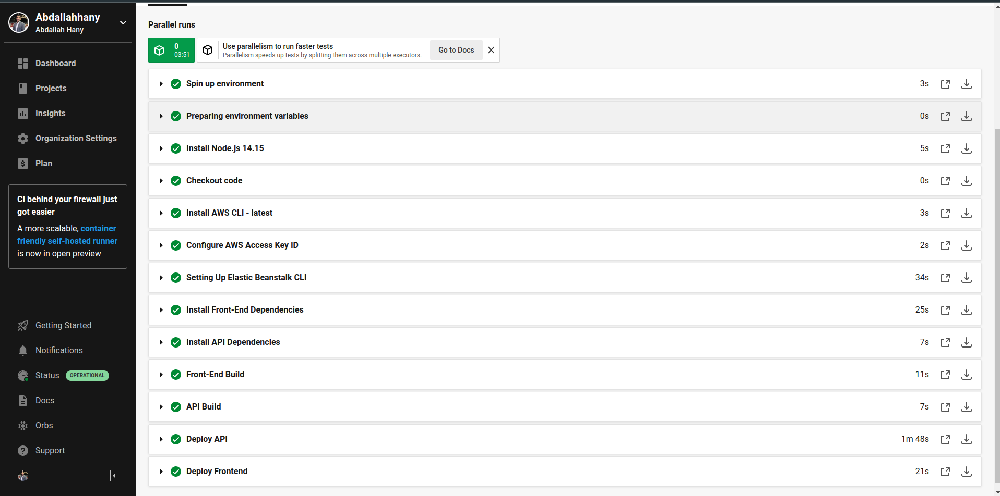
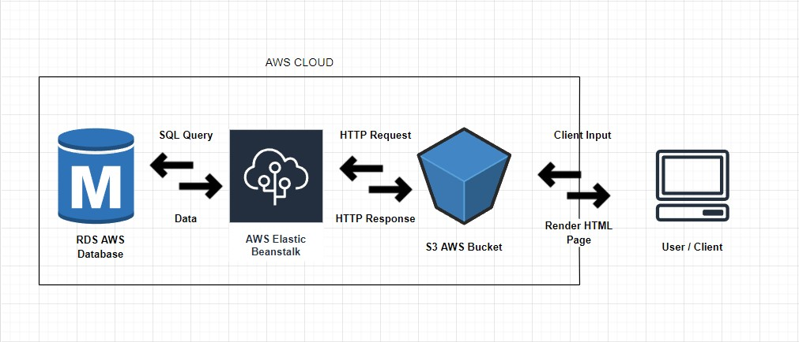

# Udagram

This application is provided to you as an alternative starter project if you do not wish to host your own code done in the previous courses of this nanodegree. The udagram application is a fairly simple application that includes all the major components of a Full-Stack web application.
## Getting Started
1- Clone the repo:

```
git clone https://github.com/Abdallahhany/Hosting-a-Full-Stack-Application
```
2- add `.env` file in `udagram/udagram/api` which contain:
```.dotenv
POSTGRES_USERNAME=
POSTGRES_PASSWORD=
POSTGRES_DB=
PORT=
POSTGRES_HOST=
AWS_DEFAULT_REGION=
AWS_PROFILE=
AWS_BUCKET=
URL=
JWT_SECRET=
EB_APP=
EB_ENV=
```
3- Install the required dependencies in both `api` & `frontend`
```
npm install
```
4- Run`frontend`
```
npm run start
```
Run api
```
npm run start-dev
```
## Project Overview:
Frontend deployed in s3:
```
S3 Bucket: `udagramprojectbucket`
S3 URL: `http://udagramprojectbucket.s3-website-us-west-2.amazonaws.com`
```


Backend deployed in Elastic Beanstalk:
```
Application Name: `udagram-api`  
Enviroment Name: `udagram-api-dev`
URL: `http://udagram-api-dev.us-west-2.elasticbeanstalk.com`
```


Database Deployed in RDS:
```
DB URL: `udagram-database.c5sxnudi1lbf.us-east-1.rds.amazonaws.com`
```


Deployment Process In CircleCi:


App Structure Diagram:

CircleCi PipeLine:

Package.json SCRIPTS:
```json 
  "frontend:install": "cd udagram/udagram-frontend && npm install -f",
  "frontend:start": "cd udagram/udagram-frontend && npm run start",
  "frontend:build": "cd udagram/udagram-frontend && npm run build",
  "frontend:test": "cd udagram/udagram-frontend && npm run test",
  "frontend:e2e": "cd udagram/udagram-frontend && npm run e2e",
  "frontend:lint": "cd udagram/udagram-frontend && npm run lint",
  "frontend:deploy": "cd udagram/udagram-frontend && npm run deploy",
  "api:install": "cd udagram/udagram-api && npm install .",
  "api:build": "cd udagram/udagram-api && npm run build",
  "api:start": "cd udagram/udagram-api && npm run dev",
  "api:deploy": "cd udagram/udagram-api && npm run deploy",
  "deploy": "npm run api:deploy && npm run frontend:deploy"
```
### Dependencies

```
- Node v14.15.1 (LTS) or more recent. While older versions can work it is advisable to keep node to latest LTS version

- npm 6.14.8 (LTS) or more recent, Yarn can work but was not tested for this project

- AWS CLI v2, v1 can work but was not tested for this project

- A RDS database running Postgres.

- A S3 bucket for hosting uploaded pictures.

```
### Installation

Provision the necessary AWS services needed for running the application:

1. In AWS, provision a publicly available RDS database running Postgres. <Place holder for link to classroom article>
1. In AWS, provision a s3 bucket for hosting the uploaded files. <Place holder for tlink to classroom article>
1. Export the ENV variables needed or use a package like [dotnev](https://www.npmjs.com/package/dotenv)/.
1. From the root of the repo, navigate udagram-api folder `cd starter/udagram-api` to install the node_modules `npm install`. After installation is done start the api in dev mode with `npm run dev`.
1. Without closing the terminal in step 1, navigate to the udagram-frontend `cd starter/udagram-frontend` to intall the node_modules `npm install`. After installation is done start the api in dev mode with `npm run start`.

## Testing

This project contains two different test suite: unit tests and End-To-End tests(e2e). Follow these steps to run the tests.

1. `cd starter/udagram-frontend`
1. `npm run test`
1. `npm run e2e`

There are no Unit test on the back-end

### Unit Tests:

Unit tests are using the Jasmine Framework.

### End to End Tests:

The e2e tests are using Protractor and Jasmine.

## Built With

- [Angular](https://angular.io/) - Single Page Application Framework
- [Node](https://nodejs.org) - Javascript Runtime
- [Express](https://expressjs.com/) - Javascript API Framework

## Author

[Abdallah Rashed](https://github.com/Abdallahhany/)
